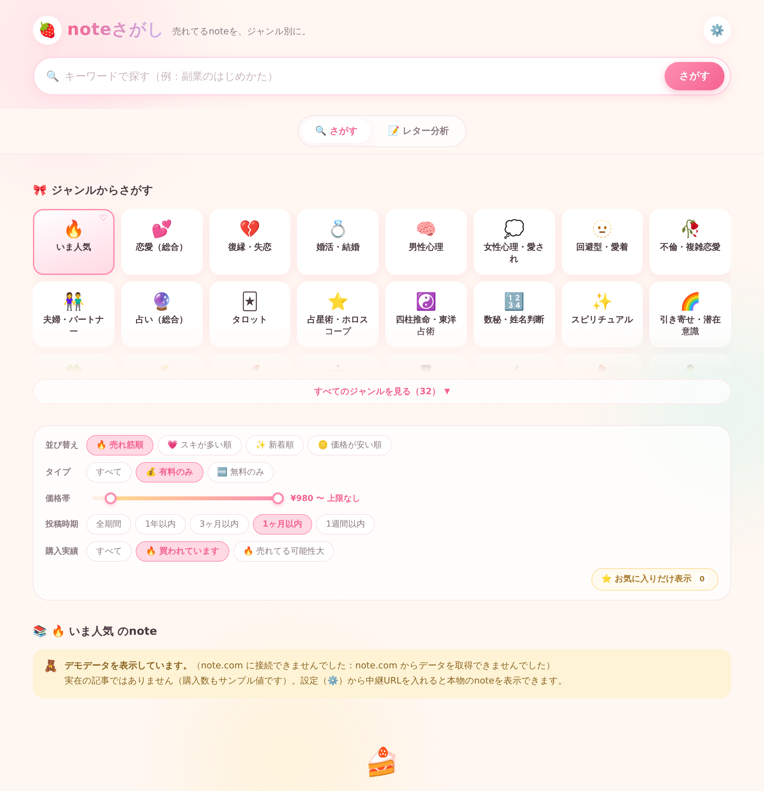

# 🍓 noteさがし

売れてるnoteを、ジャンル別に探せるかわいい検索アプリ。
ビルド不要のHTML/CSS/JavaScriptだけで動きます。



## できること

### 🔍 noteをさがす

- **31ジャンル＋「いま人気」** から、note の記事をワンタップで検索
  （1ジャンルにつきキーワード5個 × 3ページ ＝ 最大300件をまとめて取得）
  - 恋愛は8分割：恋愛全般／復縁・失恋／婚活・結婚／男性心理／女性心理・愛され／
    回避型・愛着／不倫・複雑恋愛／夫婦・パートナー
  - 占いは8分割：占い全般／タロット／占星術／四柱推命・東洋占術／数秘・姓名判断／
    スピリチュアル／引き寄せ・潜在意識／開運・金運
- **キーワード検索**（例：「副業のはじめかた」）
- **並び替え**：🔥 売れ筋順 / 💗 スキが多い順 / ✨ 新着順 / 🪙 価格が安い順
- **絞り込み**：有料・無料 / 価格帯スライダー / 投稿時期（1週間〜1年）/ 購入実績
- **初期設定は「有料のみ ＋ ¥980以上 ＋ 🔥買われています」**（投稿時期は全期間）。
  開いた時点で、いま実際に売れている有料noteだけが並びます
  （変えたい場合は `assets/app.js` の `state` の初期値と `DEFAULT_MIN_PRICE`）
  - 投稿時期をあえて絞っていないのは、「買われています」が**購入の新しさ**を
    表すフラグだからです。2年前のnoteが昨日売れていれば、それこそ探したい記事に
    なります。投稿日で絞ると、この2つの条件が打ち消し合って件数が出ません
  - 投稿時期を1ヶ月以内より短く絞ったときだけ、検索APIを人気順ではなく
    新着順で叩きます。人気順だと古い記事ばかり返ってきて期間で弾かれるため
- **結果が0件だったジャンルは自動で非表示**。一度開いて0件だったジャンルを覚えて
  次から隠します（「すべて表示」でいつでも戻せます）
- **🔥 買われています**：note公式の「買われています｜過去24時間」と同じデータで、
  実際に売れているnoteだけを抽出（推定ではなく実データ）
- **⭐ お気に入り**：ブラウザに保存されるので、あとから見返せる
- **売れ筋スコア**：価格 ×（スキ数 ＋ コメント数×5）を、表示中の記事のなかで
  100点満点に正規化。購入実績のある記事は上位に来るよう重みづけ
- **📄 有料部分の文字数**：価格に対するボリュームが一目で分かる
- スマホ・PC両対応、URLに条件が入るので共有もできる

### 📝 セールスレター分析

**noteのURLを貼って「取り込む」を押すだけ**で本文を取得して分析します
（記事詳細API → だめなら記事ページのHTML、の順に試します）。
検索結果のカードにある **📝 分析** ボタンからも直接送れます。
テキストを直接貼り付けてもOKです。

有料noteの場合、読み取れるのは**無料部分だけ**です。
つまりセールスレターそのものなので、分析対象としてはこれで十分です。

売れているレターに入っている**12の要素**がそろっているかを判定します。

| | 見ている要素 | | |
|---|---|---|---|
|🎣|フック（冒頭の引き）|🫂|共感・問題提起|
|📖|ストーリー・実体験|📊|実績・証拠|
|💬|お客様の声|✨|ベネフィット|
|📦|中身・目次|💰|価格の提示と理由づけ|
|⏳|限定性・緊急性|🛡|リスク除去・保証|
|👇|CTA（行動の指示）|✉️|追伸|

出力されるもの：

- **構成スコア（100点満点）** と S〜D の判定
- **レターの型**（ストーリー訴求型・実績訴求型・ノウハウ提示型など）
- 要素ごとの ✅／⚠️不足 と、見つかった箇所の抜粋
- 不足している要素の **直し方**（配点の高い順）
- 文字数・段落・見出し数・数字の登場回数・**価格が出てくる位置(%)** などの数値
- 読みやすさの指摘（段落が長い、見出しが少ない、価格提示が早すぎる など）

自分のレターの点検にも、参考にしたい他の人のレターの分解にも使えます。
判定はキーワードと文章構造による機械的なチェックで、**売上を予測するものではありません**。

## 使いかた

このリポジトリを開いて `index.html` をブラウザで開くだけです。

```bash
# ローカルで見る場合（file:// でも動きますが、http のほうが確実です）
python3 -m http.server 8000
# → http://localhost:8000
```

### GitHub Pages で公開する

1. リポジトリの **Settings → Pages** を開く
2. **Source** を `Deploy from a branch`、ブランチをこのブランチ（または `main`）、
   フォルダを `/ (root)` に設定
3. 数十秒待つと `https://<ユーザー名>.github.io/<リポジトリ名>/` で公開されます

ビルド作業やサーバーは不要です。

## データについて

note.com の公開検索API（`https://note.com/api/v3/searches`）を
ブラウザから直接読み込んで表示しています。

### 記事が出てこないとき（CORSエラー）

note.com 側の設定によっては、ブラウザから直接APIを読めないことがあります
（コンソールに CORS エラーが出ます）。その場合の動きは次のとおりです。

1. まず直接アクセスを試す
2. だめなら公開の中継サービス（corsproxy.io / allorigins）を順に試す
3. それも通らなければ **デモデータ**に切り替えて画面を保つ
   （画面上に「デモデータを表示しています」と明示されます）

自前の中継を使いたいときは、右上の **⚙️ 設定** から中継URLを登録できます。
`{url}` の部分が、取得先URL（URLエンコード済み）に置き換わります。

```
https://自分のワーカー.example.workers.dev/?url={url}
```

### 自前の中継サーバーを立てる（推奨）

公開の中継サービス（corsproxy.io など）は共用のため、
購入状況を300件ぶん調べるような使い方だと途中で弾かれます。
自分専用の中継を Cloudflare Workers に置くと、この制限がなくなります。無料枠で足ります。

コードは **[`worker/note-proxy.js`](worker/note-proxy.js)** にあります。
これを Cloudflare Workers に貼り付けてデプロイし、発行されたURLを

```
https://<自分のワーカー名>.workers.dev/?url={url}
```

の形でアプリの ⚙️設定 → CORSプロキシ に登録するだけです。

note.com 以外へは中継しない作りなので、URLを知られても踏み台にはなりません。
同じURLの結果を5分間キャッシュするので、note側への負荷も抑えられます。

### note の検索APIが返すもの（実測）

診断機能で確認した結果、1記事あたり返ってくる数値は次のとおりでした。

| 項目 | 内容 |
|---|---|
| `like_count` | スキの数 |
| `comment_count` | コメントの数 |
| `price` | 価格（無料は 0） |
| `image_count` | 記事内の画像数 |
| `id` | 記事ID |

**購入数は含まれていません。** また、ブラウザからの直接アクセスはCORSで
ブロックされるため、実際には中継サーバー（corsproxy.io など）を経由して
取得しています。

### 🔥「買われています」の判定について

note.com が記事に出している「**買われています｜過去24時間**」バッジと
**同じデータ**を使っています。検索APIには含まれていませんが、
記事詳細API（`/api/v3/notes/{key}`）に次のフラグがあります。

| フィールド | 意味 | アプリでの表示 |
|---|---|---|
| `is_purchased_within_last_24_hours` | 過去24時間に購入された | 🔥 買われています |
| `is_recently_purchased` | 最近購入された | 📈 最近買われた |

検索結果に出た記事について、この詳細APIを**1件ずつ後から取得**して補完します。
価格などの条件を満たしたものを**上位300件まで**調べます
（同時5本まで。`DETAIL_LIMIT` / `DETAIL_CONCURRENCY` で変更可）。
取得中は絞り込みの横に「購入状況を確認中… n/m件」と進捗が出て、
判明したものから順に画面に増えていきます。

一度調べた記事は `sessionStorage` に保存されるので、ジャンルを行き来したり
ページを再読み込みしても調べ直しません。

中継サーバーに連続で弾かれた場合（12回）は自動で打ち切り、
「自分の中継URLを設定すると最後まで調べられます」と案内します。
300件ぶんの問い合わせを公開の中継サービスで捌くのは無理があるので、
**自前のCloudflare Workersを設定するのを強くおすすめします**（下記）。

このフラグが立っている記事は売れ筋スコアも優遇されます（24時間以内は4倍、
最近は2倍）。**推定ではなく実データ**です。

購入「数」そのものは公開されていないため取得できません。

### そのほか記事詳細APIから取っているもの

| フィールド | 表示 |
|---|---|
| `remained_char_num` | 📄 有料部分の文字数（ボリュームの目安） |

APIが実際に何を返しているかは、⚙️設定 →「🔬 APIの中身を調べる」で確認できます。
また「🔎『買われています』の出どころを探す」に記事URLを貼ると、
その記事のJSONから購入まわりの項目を探して表示します。

なお「投稿時期」の絞り込みは**記事の公開日**が基準です。
購入された日時は公開されていないため、「1週間以内に売れたnote」は
どのAPIからも取得できません。近いことをしたい場合は
「投稿時期：1週間以内 ＋ 有料のみ ＋ 売れ筋順」で見てください。

### 「売れ筋スコア」の計算

購入数が取れないため、スコアは次の**推定**です。

```
売れ筋スコア = 価格 × (スキ数 + コメント数 × 5)
```

コメントを5倍に重みづけしているのは、有料noteにわざわざコメントする人は
購入者である可能性が高く、スキよりも購入に近い信号だからです。
重みは `assets/app.js` の `COMMENT_WEIGHT` で変えられます。

実際の販売数ではないので、目安として使ってください。

## ファイル構成

```
index.html            画面
assets/style.css      デザイン（パステル配色・レスポンシブ）
assets/app.js         検索・絞り込み・描画・お気に入り
assets/genres.js      ジャンル定義（絵文字・名前・検索キーワード）
assets/analyzer.js    セールスレター分析（12要素の判定ルール）
assets/sample-data.js デモデータ（実在の記事ではありません）
worker/note-proxy.js  自前の中継サーバー用コード（Cloudflare Workers）
```

### 分析の判定ルールを変える

`assets/analyzer.js` の `RULES` 配列を編集します。
`weight` が配点、`patterns` が検出用の正規表現、`hint` が不足時に出るアドバイスです。

```js
{
  key: 'guarantee',
  emoji: '🛡',
  name: 'リスク除去・保証',
  weight: 5,
  patterns: [/返金/, /保証/, /向いていない人/],
  hint: '「こういう人には向きません」を書くのが最強のリスク除去。',
},
```

### ジャンルを増やす・変える

`assets/genres.js` に1行足すだけです。

```js
{ id: 'pet', emoji: '🐈', name: 'ペット', queries: ['猫', '犬'] },
```

`queries` を複数書くと、それぞれの検索結果をまとめて重複を除いて表示します。
